# QMS Change Control Module — Architecture Design

## Table of Contents

1. [Architecture Overview](#1-architecture-overview)
2. [Domain Model](#2-domain-model)
3. [Database Gap Analysis](#3-database-gap-analysis)
4. [Schema Status](#4-schema-status)
5. [Backend Architecture (NestJS)](#5-backend-architecture-nestjs)
6. [Frontend Architecture (React)](#6-frontend-architecture-react)
7. [API Design](#7-api-design)
8. [Cross-Cutting Concerns](#8-cross-cutting-concerns)
9. [Architecture Decision Records](#9-architecture-decision-records)

---

## 1. Architecture Overview

**Pattern: Modular Monolith** — Single NestJS deployment with strict module boundaries.

```
┌──────────────────────────────────────────────────────────────────┐
│                        React Frontend                            │
│  ┌─────────┐ ┌──────────┐ ┌──────────┐ ┌───────┐ ┌───────────┐ │
│  │ CC List │ │CC Detail │ │ Workflow │ │ Admin │ │ Task Mgmt │ │
│  └─────────┘ └──────────┘ └──────────┘ └───────┘ └───────────┘ │
└──────────────────────────┬───────────────────────────────────────┘
                           │ REST API (JSON)
┌──────────────────────────┴───────────────────────────────────────┐
│                      NestJS Backend                               │
│  ┌──────────────┐ ┌──────────────┐ ┌──────────────────────────┐  │
│  │ Change       │ │ Workflow     │ │ User & Access            │  │
│  │ Control      │ │ Engine       │ │ Module                   │  │
│  │ Module       │ │ Module       │ │                          │  │
│  └──────┬───────┘ └──────┬───────┘ └──────────────────────────┘  │
│  ┌──────┴───────┐ ┌──────┴───────┐ ┌──────────────────────────┐  │
│  │ Approval     │ │ Action Plan  │ │ Audit Trail              │  │
│  │ Module       │ │ Module       │ │ Module                   │  │
│  └──────────────┘ └──────────────┘ └──────────────────────────┘  │
│  ┌──────────────┐ ┌──────────────┐ ┌──────────────────────────┐  │
│  │ E-Signature  │ │ Notification │ │ Task Management          │  │
│  │ Module       │ │ Module       │ │ Module                   │  │
│  └──────────────┘ └──────────────┘ └──────────────────────────┘  │
└──────────────────────────┬───────────────────────────────────────┘
                           │
                    ┌──────┴──────┐
                    │   MySQL DB  │
                    └─────────────┘
```

**Why Modular Monolith over Microservices:**
- Single team maintaining this module; microservices add operational overhead with no real payoff
- GMP compliance demands strong consistency across the CC lifecycle (steps, approvals, e-signatures, audit) — distributed transactions are a nightmare here
- Module boundaries are enforced at the code level (NestJS module imports), not at the network level
- Can extract to services later if needed, but likely never will for a single QMS module

**Trade-off acknowledged:** If this grows to 5+ independent QMS modules with different teams, consider extracting Notification and Audit Trail as shared services.

---

## 2. Domain Model

### 2.1 Bounded Contexts

```
┌─ Change Control Context (Core) ──────────────────────────────────┐
│                                                                   │
│  ChangeControl (Aggregate Root)                                   │
│  ├── ProcessStep[] (Entity, ordered, sequential)                  │
│  │   ├── StepAssignment (Value Object)                            │
│  │   └── AddendumVersion[] (Entity)                               │
│  ├── Project[] (Entity, 1 product = 1 project)                    │
│  ├── ChangeRequest (Entity — Step 1 form data)                    │
│  └── EffectivenessCheck (Entity — Step 7 form data)               │
│                                                                   │
│  Opinion (Aggregate)                                              │
│  ├── OpinionPIC (Entity, per-department)                          │
│  ├── OpinionCollaborator[] (Entity, extra PICs per opinion)       │
│  └── OpinionSubmission (Entity, per-PIC)                          │
│                                                                   │
│  ActionPlan (Aggregate, per-project)                              │
│  ├── ActionItem[] (Entity)                                        │
│  │   ├── NextTaskPIC[] (Value Object)                             │
│  │   └── ImplementationRecord (Entity, per-PIC)                   │
│  └── ActionPlanRevision[] (Entity)                                │
│                                                                   │
└───────────────────────────────────────────────────────────────────┘

┌─ Approval Context (Supporting) ──────────────────────────────────┐
│                                                                   │
│  Approval (Aggregate Root)                                        │
│  └── ApprovalDetail[] (Entity, ordered approvers)                 │
│                                                                   │
└───────────────────────────────────────────────────────────────────┘

┌─ E-Signature Context (Supporting) ───────────────────────────────┐
│                                                                   │
│  ESignature (Aggregate Root)                                      │
│  — Captures: user identity, timestamp, action, meaning statement  │
│  — Immutable once created                                         │
│                                                                   │
└───────────────────────────────────────────────────────────────────┘

┌─ User & Access Context (Supporting) ─────────────────────────────┐
│                                                                   │
│  User (Aggregate Root)                                            │
│  ├── Role (Entity)                                                │
│  ├── Delegation (Entity, temporary ownership transfer)            │
│  └── Reassignment (Entity, permanent ownership transfer)          │
│                                                                   │
│  UserTask (Entity, centralized task ownership)                    │
│  — Single source of truth for "who owns this task"                │
│  — Delegation & reassignment operate on this table only           │
│                                                                   │
└───────────────────────────────────────────────────────────────────┘

┌─ Audit Trail Context (Generic Subdomain) ────────────────────────┐
│                                                                   │
│  AuditEntry (Aggregate Root, append-only, immutable)              │
│  — NO update, NO delete operations exposed                        │
│                                                                   │
└───────────────────────────────────────────────────────────────────┘

┌─ Notification Context (Generic Subdomain) ───────────────────────┐
│                                                                   │
│  Notification (Aggregate Root)                                    │
│  — Event-driven: listens to domain events, dispatches messages    │
│                                                                   │
└───────────────────────────────────────────────────────────────────┘
```

### 2.2 Domain Events

These are the events that flow between modules. In a modular monolith, these are in-process events via NestJS EventEmitter (or a lightweight event bus). They drive the Audit Trail and Notification modules without tight coupling.

| Event | Emitted By | Consumed By |
|---|---|---|
| `ChangeControlCreated` | CC Module | Audit, Notification |
| `StepAssigned` | Workflow Engine | Audit, Notification |
| `StepReassigned` | Task Mgmt / Admin | Audit, Notification |
| `StepCompleted` | Workflow Engine | Audit, Notification |
| `StepSubmittedForApproval` | Workflow Engine | Approval, Audit, Notification |
| `ApprovalGranted` | Approval Module | Workflow Engine, Audit, Notification |
| `ApprovalRejected` | Approval Module | Workflow Engine, Audit, Notification |
| `OpinionPICAssigned` | CC Module (Step 2) | Audit, Notification |
| `OpinionCollaboratorAdded` | CC Module (Step 3) | Audit, Notification |
| `OpinionCollaboratorRemoved` | CC Module (Step 3) | Audit |
| `OpinionCollaboratorInputCompleted` | CC Module (Step 3) | Audit, Notification |
| `OpinionSubmitted` | CC Module (Step 3) | Audit, Notification |
| `ActionPlanItemCreated` | Action Plan Module | Audit, Notification |
| `ActionPlanItemModified` | Action Plan Module | Audit |
| `ImplementationRecordSubmitted` | Action Plan Module | Audit, Notification |
| `ESignatureCaptured` | E-Signature Module | Audit |
| `AttachmentUploaded` | CC Module | Audit |
| `AddendumCreated` | CC Module | Audit |
| `DelegationCreated` | Task Mgmt Module | Audit |
| `ReassignmentCreated` | Task Mgmt Module | Audit |
| `DelegationExpired` | Task Mgmt Module (scheduled) | Audit |

### 2.3 Aggregate Invariants

| Aggregate | Invariants |
|---|---|
| ChangeControl | Steps are strictly sequential; a step cannot start until the previous is completed/approved |
| ProcessStep | Only one assigned user at a time (except Steps 3 & 6); only assigned user (resolved via QMS_USER_TASK) can mutate |
| Approval | Approvers are ordered; each must approve in sequence; rejection halts the chain |
| Opinion | Each PIC can only submit once; step completes only when ALL PICs have submitted. Main PIC cannot submit until all collaborators have status COMPLETED. Collaborators can only be added/removed by the main PIC. |
| ActionPlan | Per-project; step 5 completes only when ALL projects have plans; step 6 completes only when ALL action items across ALL projects are implemented |
| ESignature | Immutable after creation; must contain user identity + timestamp + action + meaning |
| AuditEntry | Append-only; no update or delete operations exist |

---

## 3. Database Gap Analysis

Comparing `table.sql` against `NEW QMS.md` requirements.

**Status: All critical and high-severity gaps have been resolved.**

### 3.1 Resolved Gaps

| # | Original Gap | Severity | Resolution |
|---|---|---|---|
| 1 | No E-Signature table | CRITICAL | `QMS_ESIGNATURE` created with full GMP fields (user identity, timestamp, action, meaning statement, IP) |
| 2 | No CC-level STATUS field | HIGH | `STATUS VARCHAR(30) DEFAULT 'DRAFT'` added to `QMS_CHANGE_CONTROL` with index |
| 3 | No STEP_ORDER on steps | HIGH | `STEP_ORDER INT DEFAULT 0` added to `QMS_CHANGE_CONTROL_STEPS` with composite index |
| 4 | Risk Assessment incomplete | HIGH | Added `HAZARD_IDENTIFICATION`, `RISK_ANALYSIS`, `RISK_EVALUATION`, `RISK_CONTROL`, `REGISTRATION_TYPE` to `QMS_CHANGE_CONTROL_RISK_ASSESSMENT` |
| 5 | No Notification table | HIGH | `QMS_NOTIFICATION` created with event type, polymorphic reference, read tracking |
| 6 | No Attachment table | MEDIUM | `QMS_ATTACHMENT` created with polymorphic `(REFERENCE_TYPE, REFERENCE_ID)` pattern |
| 7 | Missing CHANGE_GROUP field | MEDIUM | Added to both `QMS_CHANGE_CONTROL` and `QMS_CHANGE_CONTROL_REQUEST` |
| 8 | No Next Task PIC | MEDIUM | `QMS_ACTION_PLAN_NEXT_PIC` join table created with unique constraint |
| 9 | No Task Reassignment table | MEDIUM | `UAR_TASK_REASSIGNMENT` created for permanent ownership transfers |

### 3.2 Resolved Schema Inconsistencies

| Original Issue | Resolution |
|---|---|
| `EXISTING_STATUS` was `VARCHAR(50)` | Changed to `TEXT` on `QMS_CHANGE_CONTROL_REQUEST` |
| No `CHANGE_GROUP` field anywhere | Added to `QMS_CHANGE_CONTROL` and `QMS_CHANGE_CONTROL_REQUEST` |
| Opinion table missing `STATUS` | `STATUS VARCHAR(30) DEFAULT 'PENDING'` added to `QMS_CHANGE_CONTROL_OPINION` with index |
| `MST_AUDIT_TRAIL` naming | Renamed to `QMS_AUDIT_TRAIL` |
| `APPROVAL_ID` FK missing on steps | Deferred `ALTER TABLE` adds `FK_CCS_APPROVAL` referencing `QMS_APPROVAL(ID)` (circular dependency) |

### 3.3 Remaining Minor Items

| # | Item | Severity | Details |
|---|---|---|---|
| 1 | Effectiveness Yes/No field types | LOW | `IMPACT`, `RISK`, `DEVIATION`, `DISCREPANCY` on `QMS_CHANGE_CONTROL_EFFECTIVENESS` use `VARCHAR(150)` — could normalize to `TINYINT(1)` or `ENUM('YES','NO')`. Functionally correct as-is. |
| 2 | `INPUT_FLAG` on action plan | LOW | `QMS_ACTION_PLAN.INPUT_FLAG VARCHAR(30)` — not in spec; purpose unclear. Harmless but may warrant cleanup. |
| 3 | Legacy `ATTACHMENT` VARCHAR columns | LOW | `QMS_CHANGE_CONTROL_RISK_ASSESSMENT` and `QMS_CHANGE_CONTROL_EFFECTIVENESS` still have inline `ATTACHMENT VARCHAR(500)` alongside the polymorphic `QMS_ATTACHMENT` table. Consider removing in a future migration. |

### 3.4 Centralized Task Ownership Refactoring

Task assignment columns have been **removed** from individual tables and centralized into `QMS_USER_TASK`:

| Table | Column Removed | Now Resolved Via |
|---|---|---|
| `QMS_CHANGE_CONTROL_STEPS` | `ASSIGNEE_ID` | `QMS_USER_TASK WHERE TASK_TYPE = 'STEP'` |
| `QMS_CHANGE_CONTROL_OPINION` | `PIC` | `QMS_USER_TASK WHERE TASK_TYPE = 'OPINION'` |
| `QMS_ACTION_PLAN` | `PIC` | `QMS_USER_TASK WHERE TASK_TYPE = 'ACTION_PLAN'` |
| `QMS_APPROVAL_DETAILS` | `ASSIGNEE_TO` | `QMS_USER_TASK WHERE TASK_TYPE = 'APPROVAL'` |
| `QMS_ACTION_PLAN_TIME_STAMP` | `PIC` | `CREATED_BY` on the timestamp record (the acting user) |

`UAR_DELEGATION_TASK_HISTORY` has been **removed** — its purpose is absorbed by `QMS_USER_TASK.DELEGATION_ID` + `ORIGINAL_OWNER`.

---

## 4. Schema Status

**All proposed changes have been applied directly into the `CREATE TABLE` statements in `table.sql`.** No separate migration or ALTER script is needed for a fresh deployment.

### 4.1 Deferred Foreign Key (Circular Dependency)

`QMS_CHANGE_CONTROL_STEPS.APPROVAL_ID` references `QMS_APPROVAL.ID`, but `QMS_APPROVAL` is defined after `QMS_CHANGE_CONTROL_STEPS` in creation order. This FK is applied as an ALTER TABLE at the end of the script:

```sql
ALTER TABLE QMS_CHANGE_CONTROL_STEPS
    ADD CONSTRAINT FK_CCS_APPROVAL FOREIGN KEY (APPROVAL_ID) REFERENCES QMS_APPROVAL(ID)
    ON DELETE SET NULL ON UPDATE CASCADE;
```

### 4.2 Applied Changes Summary

| Table | What Changed |
|---|---|
| `QMS_CHANGE_CONTROL` | +`CHANGE_GROUP VARCHAR(30)`, +`STATUS VARCHAR(30) DEFAULT 'DRAFT'`, +`IDX_CC_STATUS` |
| `QMS_CHANGE_CONTROL_STEPS` | +`STEP_ORDER INT DEFAULT 0`, +`IDX_CCS_ORDER`, +FK to `QMS_APPROVAL` (deferred) |
| `QMS_CHANGE_CONTROL_REQUEST` | `EXISTING_STATUS` → `TEXT`, +`CHANGE_GROUP VARCHAR(30)` |
| `QMS_CHANGE_CONTROL_RISK_ASSESSMENT` | +`HAZARD_IDENTIFICATION TEXT`, +`RISK_ANALYSIS TEXT`, +`RISK_EVALUATION TEXT`, +`RISK_CONTROL TEXT`, +`REGISTRATION_TYPE VARCHAR(50)` |
| `QMS_CHANGE_CONTROL_OPINION` | +`STATUS VARCHAR(30) DEFAULT 'PENDING'`, +`IDX_CCO_STATUS` |
| `MST_AUDIT_TRAIL` → `QMS_AUDIT_TRAIL` | Table renamed |

### 4.3 New Tables (already in `table.sql`)

| Table | Purpose |
|---|---|
| `QMS_ESIGNATURE` | GMP-compliant e-signature capture (immutable, append-only) |
| `QMS_NOTIFICATION` | Event-driven user notifications with read tracking |
| `QMS_ATTACHMENT` | Polymorphic file attachment storage |
| `QMS_ACTION_PLAN_NEXT_PIC` | Next Task PIC join table for action plan items |
| `UAR_TASK_REASSIGNMENT` | Permanent task ownership transfer tracking |
| `QMS_USER_TASK` | Centralized task ownership — single source of truth for all task assignments, delegation, and reassignment |
| `QMS_OPINION_COLLABORATOR` | Extra PICs collaborating on an opinion entry (main PIC submits after all done) |

---

## 5. Backend Architecture (NestJS)

### 5.1 Module Structure

```
backend/
├── src/
│   ├── main.ts
│   ├── app.module.ts
│   │
│   ├── common/                              # Shared kernel
│   │   ├── decorators/
│   │   │   ├── current-user.decorator.ts    # Extract user from request
│   │   │   └── require-esignature.decorator.ts
│   │   ├── guards/
│   │   │   ├── auth.guard.ts
│   │   │   ├── step-access.guard.ts         # Enforce step-level permissions
│   │   │   └── role.guard.ts
│   │   ├── interceptors/
│   │   │   └── audit-trail.interceptor.ts   # Auto-log mutations
│   │   ├── events/
│   │   │   └── domain-events.ts             # All event type definitions
│   │   ├── pipes/
│   │   │   └── validation.pipe.ts
│   │   ├── filters/
│   │   │   └── http-exception.filter.ts
│   │   └── types/
│   │       ├── step-status.enum.ts
│   │       ├── cc-status.enum.ts
│   │       └── reference-type.enum.ts
│   │
│   ├── change-control/                      # Core Domain Module
│   │   ├── change-control.module.ts
│   │   ├── change-control.controller.ts
│   │   ├── change-control.service.ts
│   │   ├── dto/
│   │   │   ├── create-cc.dto.ts
│   │   │   └── update-cc.dto.ts
│   │   ├── entities/
│   │   │   ├── change-control.entity.ts
│   │   │   ├── change-request.entity.ts     # Step 1 form data
│   │   │   ├── risk-assessment.entity.ts    # Step 4 form data
│   │   │   ├── effectiveness-check.entity.ts # Step 7 form data
│   │   │   └── project.entity.ts
│   │   └── repositories/
│   │       └── change-control.repository.ts
│   │
│   ├── workflow/                             # Workflow Engine Module
│   │   ├── workflow.module.ts
│   │   ├── workflow.service.ts              # Step progression logic
│   │   ├── workflow.controller.ts
│   │   ├── dto/
│   │   │   ├── complete-step.dto.ts
│   │   │   └── assign-step.dto.ts
│   │   ├── entities/
│   │   │   ├── process-step.entity.ts
│   │   │   └── addendum-history.entity.ts
│   │   ├── guards/
│   │   │   └── step-owner.guard.ts          # Only assigned user can act
│   │   └── services/
│   │       ├── step-generator.service.ts    # Creates steps from template
│   │       └── step-transition.service.ts   # Handles step state machine
│   │
│   ├── opinion/                             # Opinion Module (Steps 2 & 3)
│   │   ├── opinion.module.ts
│   │   ├── opinion.controller.ts
│   │   ├── opinion.service.ts
│   │   ├── dto/
│   │   │   ├── assign-pic.dto.ts
│   │   │   ├── submit-opinion.dto.ts
│   │   │   ├── add-collaborator.dto.ts
│   │   │   └── submit-collaborator-input.dto.ts
│   │   └── entities/
│   │       ├── opinion.entity.ts
│   │       └── opinion-collaborator.entity.ts
│   │
│   ├── action-plan/                         # Action Plan Module (Steps 5 & 6)
│   │   ├── action-plan.module.ts
│   │   ├── action-plan.controller.ts
│   │   ├── action-plan.service.ts
│   │   ├── dto/
│   │   │   ├── create-action-item.dto.ts
│   │   │   ├── submit-implementation.dto.ts
│   │   │   └── assign-next-pic.dto.ts
│   │   └── entities/
│   │       ├── action-plan.entity.ts
│   │       ├── action-plan-timestamp.entity.ts
│   │       └── action-plan-next-pic.entity.ts
│   │
│   ├── approval/                            # Approval Module
│   │   ├── approval.module.ts
│   │   ├── approval.controller.ts
│   │   ├── approval.service.ts
│   │   ├── dto/
│   │   │   ├── request-approval.dto.ts
│   │   │   └── approve-reject.dto.ts
│   │   └── entities/
│   │       ├── approval.entity.ts
│   │       └── approval-detail.entity.ts
│   │
│   ├── esignature/                          # E-Signature Module
│   │   ├── esignature.module.ts
│   │   ├── esignature.controller.ts
│   │   ├── esignature.service.ts
│   │   ├── dto/
│   │   │   └── capture-esignature.dto.ts
│   │   └── entities/
│   │       └── esignature.entity.ts
│   │
│   ├── audit-trail/                         # Audit Trail Module
│   │   ├── audit-trail.module.ts
│   │   ├── audit-trail.controller.ts        # Read-only: list & export
│   │   ├── audit-trail.service.ts
│   │   ├── listeners/
│   │   │   └── audit-event.listener.ts      # Subscribes to ALL domain events
│   │   └── entities/
│   │       └── audit-entry.entity.ts
│   │
│   ├── notification/                        # Notification Module
│   │   ├── notification.module.ts
│   │   ├── notification.controller.ts
│   │   ├── notification.service.ts
│   │   ├── listeners/
│   │   │   └── notification-event.listener.ts
│   │   └── entities/
│   │       └── notification.entity.ts
│   │
│   ├── task-management/                     # Task Reassignment & Delegation
│   │   ├── task-management.module.ts
│   │   ├── task-management.controller.ts
│   │   ├── services/
│   │   │   ├── delegation.service.ts
│   │   │   ├── reassignment.service.ts
│   │   │   ├── user-task.service.ts             # Centralized task ownership CRUD
│   │   │   └── delegation-scheduler.service.ts  # Cron: revert expired delegations
│   │   └── entities/
│   │       ├── delegation.entity.ts
│   │       ├── user-task.entity.ts              # QMS_USER_TASK
│   │       └── task-reassignment.entity.ts
│   │
│   ├── user/                                # User & Access Module
│   │   ├── user.module.ts
│   │   ├── user.controller.ts
│   │   ├── user.service.ts
│   │   ├── auth/
│   │   │   ├── auth.controller.ts
│   │   │   ├── auth.service.ts
│   │   │   └── strategies/
│   │   │       └── jwt.strategy.ts
│   │   └── entities/
│   │       ├── user.entity.ts
│   │       └── role.entity.ts
│   │
│   ├── attachment/                          # Attachment Module
│   │   ├── attachment.module.ts
│   │   ├── attachment.controller.ts
│   │   ├── attachment.service.ts
│   │   └── entities/
│   │       └── attachment.entity.ts
│   │
│   └── master-data/                         # Master/Reference Data
│       ├── master-data.module.ts
│       ├── master-data.controller.ts
│       ├── master-data.service.ts
│       └── entities/
│           ├── change-category.entity.ts
│           ├── change-subcategory.entity.ts
│           ├── change-source-reference.entity.ts
│           ├── approval-template.entity.ts
│           ├── steps-template.entity.ts
│           ├── action-plan-template.entity.ts
│           └── action-plan-matrix.entity.ts
│
├── config/
│   ├── database.config.ts
│   ├── jwt.config.ts
│   └── app.config.ts
│
├── database/
│   └── migrations/                          # TypeORM migrations
│
├── test/
│   ├── e2e/
│   └── unit/
│
├── .env
├── .env.example
├── nest-cli.json
├── tsconfig.json
└── package.json
```

### 5.2 Module Dependency Graph

```
                    AppModule
                       │
        ┌──────────────┼──────────────────────────┐
        │              │                           │
   CommonModule   UserModule              MasterDataModule
        │              │
        ├──────────────┼─────────────────────────────────┐
        │              │                                  │
  ChangeControlModule  │                        TaskManagementModule
        │              │
        ├──────────────┤
        │              │
  WorkflowModule   OpinionModule
        │
        ├──────────────┤
        │              │
  ApprovalModule  ActionPlanModule
        │
        ├──────────────┤
        │              │
  ESignatureModule  AttachmentModule
        │
        ├──────────────┤
        │              │
  AuditTrailModule  NotificationModule
```

**Dependency Rules:**
- `AuditTrailModule` and `NotificationModule` depend on NO domain module — they only listen to events
- `ESignatureModule` is imported by modules that need signature capture, but has no outbound dependencies
- `WorkflowModule` orchestrates step transitions and emits events consumed by others
- No circular dependencies — events break the cycle

### 5.3 Key Design Patterns

**Workflow Engine (Step State Machine):**

```typescript
// Step status transitions
// NOT_STARTED → IN_PROGRESS → PENDING_APPROVAL → APPROVED → COMPLETED
//                           → REJECTED (back to IN_PROGRESS)

type StepStatus = 'NOT_STARTED' | 'IN_PROGRESS' | 'PENDING_APPROVAL' | 'APPROVED' | 'COMPLETED';

const STEP_TRANSITIONS: Record<StepStatus, StepStatus[]> = {
  NOT_STARTED:       ['IN_PROGRESS'],
  IN_PROGRESS:       ['PENDING_APPROVAL', 'COMPLETED'],  // COMPLETED for steps w/o approval
  PENDING_APPROVAL:  ['APPROVED', 'IN_PROGRESS'],         // IN_PROGRESS = rejected, redo
  APPROVED:          ['COMPLETED'],
  COMPLETED:         [],
};
```

**Event-Driven Audit Trail:**

```typescript
// All domain modules emit events — the audit listener catches everything
@Injectable()
export class AuditEventListener {
  @OnEvent('step.completed')
  handleStepCompleted(event: StepCompletedEvent) {
    // Append to audit trail — never update, never delete
  }

  @OnEvent('field.changed')
  handleFieldChanged(event: FieldChangedEvent) {
    // Log old value, new value, who, when
  }
}
```

**E-Signature as Cross-Cutting Concern:**

```typescript
// Custom decorator to enforce e-signature on specific endpoints
@RequireESignature({
  action: 'Step 1 Submission',
  meaning: 'I confirm that the information provided is accurate and complete',
})
@Post('steps/:id/complete')
async completeStep(@Body() dto: CompleteStepDto) { ... }
```

### 5.4 ORM: TypeORM

Using TypeORM with MySQL. Entities map 1:1 to tables. Repositories use the Repository pattern.

**Why TypeORM over Prisma:**
- Mature MySQL support with migration tooling
- Decorator-based entity definitions align with NestJS patterns
- Better support for complex queries (joins, subqueries) that GMP reporting will need
- Trade-off: Prisma has better type safety, but TypeORM's query builder is more flexible for audit/reporting queries

---

## 6. Frontend Architecture (React)

### 6.1 Tech Stack

| Concern | Choice | Rationale |
|---|---|---|
| Framework | React 18+ | Specified by team |
| State Management | TanStack Query (server state) + Zustand (UI state) | TanStack Query handles API caching/invalidation natively; Zustand for lightweight local state like modals, sidebar |
| Routing | React Router v6 | Standard, supports nested layouts needed for CC detail view |
| Forms | React Hook Form + Zod | Complex multi-step forms with validation; Zod for runtime type checking |
| Rich Text | TipTap | Multiple rich text fields per step; TipTap is extensible and outputs HTML/JSON |
| UI Components | Shadcn/ui + Tailwind CSS | Modern minimalistic approach per spec; Shadcn gives accessible primitives |
| Tables | TanStack Table | Action plan tables, CC list with sorting/filtering/pagination |
| Date Handling | date-fns | Working day calculations (exclude weekends/holidays) for Step 3 due dates |
| PDF Export | react-pdf or server-side via puppeteer | Audit trail PDF export for regulatory review |

### 6.2 Folder Structure

```
frontend/
├── src/
│   ├── main.tsx
│   ├── App.tsx
│   │
│   ├── api/                                 # API layer
│   │   ├── client.ts                        # Axios instance with interceptors
│   │   ├── change-control.api.ts
│   │   ├── workflow.api.ts
│   │   ├── approval.api.ts
│   │   ├── opinion.api.ts
│   │   ├── action-plan.api.ts
│   │   ├── effectiveness.api.ts
│   │   ├── notification.api.ts
│   │   ├── user.api.ts
│   │   └── master-data.api.ts
│   │
│   ├── hooks/                               # TanStack Query hooks
│   │   ├── use-change-control.ts
│   │   ├── use-workflow.ts
│   │   ├── use-approval.ts
│   │   ├── use-opinion.ts
│   │   ├── use-action-plan.ts
│   │   ├── use-effectiveness.ts
│   │   ├── use-notifications.ts
│   │   └── use-auth.ts
│   │
│   ├── stores/                              # Zustand stores (UI state only)
│   │   ├── auth.store.ts
│   │   ├── sidebar.store.ts
│   │   └── modal.store.ts
│   │
│   ├── pages/                               # Route-level components
│   │   ├── change-control/
│   │   │   ├── CCListPage.tsx               # CC list with filters, search
│   │   │   ├── CCCreatePage.tsx             # CC creation wizard
│   │   │   └── CCDetailPage.tsx             # CC detail with step timeline
│   │   ├── task-management/
│   │   │   ├── DelegationPage.tsx
│   │   │   └── ReassignmentPage.tsx
│   │   ├── auth/
│   │   │   └── LoginPage.tsx
│   │   └── Layout.tsx                       # Shell with sidebar, topbar, notifications
│   │
│   ├── features/                            # Feature-scoped components
│   │   ├── steps/
│   │   │   ├── StepTimeline.tsx             # Progress indicator at top of CC view
│   │   │   ├── StepContainer.tsx            # Renders correct step component
│   │   │   ├── Step1CreateCC.tsx
│   │   │   ├── Step2OpinionPICSetup.tsx
│   │   │   ├── Step3InputOpinion.tsx
│   │   │   ├── Step4RiskAssessment.tsx
│   │   │   ├── Step5ActionPlanSetup.tsx
│   │   │   ├── Step6ActionPlanImpl.tsx
│   │   │   └── Step7EffectivenessCheck.tsx
│   │   ├── approval/
│   │   │   ├── ApprovalPanel.tsx            # Approve/reject UI for approvers
│   │   │   └── ApprovalHistory.tsx
│   │   ├── esignature/
│   │   │   └── ESignatureDialog.tsx         # Modal: meaning statement + password confirm
│   │   ├── audit-trail/
│   │   │   ├── AuditTrailPanel.tsx          # Chronological log within CC detail
│   │   │   └── AuditTrailExport.tsx         # PDF export trigger
│   │   ├── opinion/
│   │   │   ├── OpinionForm.tsx              # PIC opinion submission form
│   │   │   ├── OpinionCollaboratorPanel.tsx # Add/view collaborators, track input status
│   │   │   └── OpinionSummaryView.tsx       # Side-by-side view for Step 4
│   │   ├── action-plan/
│   │   │   ├── ActionPlanTable.tsx          # Per-project action item table
│   │   │   ├── ImplementationForm.tsx       # PIC implementation record form
│   │   │   └── ProjectTabs.tsx              # Tab layout for multi-project view
│   │   └── notification/
│   │       ├── NotificationBell.tsx         # Topbar notification icon + dropdown
│   │       └── NotificationList.tsx
│   │
│   ├── components/                          # Shared UI components
│   │   ├── ui/                              # Shadcn primitives (button, input, etc.)
│   │   ├── RichTextEditor.tsx               # TipTap wrapper
│   │   ├── FileUpload.tsx
│   │   ├── UserSelect.tsx                   # User picker (for assignments)
│   │   ├── DepartmentSelect.tsx
│   │   ├── StatusBadge.tsx
│   │   ├── DataTable.tsx                    # Generic TanStack Table wrapper
│   │   ├── ConfirmDialog.tsx
│   │   └── LoadingSpinner.tsx
│   │
│   ├── lib/                                 # Utilities
│   │   ├── utils.ts
│   │   ├── working-days.ts                  # Calculate due dates excluding holidays
│   │   ├── permissions.ts                   # Permission check helpers
│   │   └── constants.ts
│   │
│   └── types/                               # Shared TypeScript types
│       ├── change-control.types.ts
│       ├── step.types.ts
│       ├── approval.types.ts
│       ├── user.types.ts
│       └── api.types.ts
│
├── public/
├── index.html
├── tailwind.config.ts
├── tsconfig.json
├── vite.config.ts
└── package.json
```

### 6.3 Key UI Wireframes

**CC Detail Page Shell (wraps every step):**

```
┌──────────────────────────────────────────────────────────────────┐
│ CC-2024-0001: Formulation Change for Product X                    │
│ Status: In Progress │ Category: Process │ Site: Jakarta           │
│ Products: Product A, Product B                                    │
├──────────────────────────────────────────────────────────────────┤
│                                                                   │
│  ① ──── ② ──── ③ ──── ④ ──── ⑤ ──── ⑥ ──── ⑦                  │
│  ✓       ✓      ●      ○      ○      ○      ○                   │
│  Create  PIC   Opinion Risk   Plan   Impl   Effect.              │
│                                                                   │
├──────────────────────────────────────────────────────────────────┤
│                                                                   │
│  ┌─ ACTIVE STEP CONTENT RENDERED HERE ────────────────────────┐  │
│  │                                                             │  │
│  │  (Step 1 / Step 2 / Step 3 / ... / Step 7 component)       │  │
│  │                                                             │  │
│  └─────────────────────────────────────────────────────────────┘  │
│                                                                   │
├──────────────────────────────────────────────────────────────────┤
│ Addendum History (if any)          [+ Add Addendum to Step N]     │
│ ┌──────────┬─────────────┬──────────┬────────────────────────┐   │
│ │ Step     │ Version     │ Date     │ Reason                 │   │
│ ├──────────┼─────────────┼──────────┼────────────────────────┤   │
│ │ Step 4   │ V0 → V1     │ 3/25     │ Updated risk factors   │   │
│ └──────────┴─────────────┴──────────┴────────────────────────┘   │
├──────────────────────────────────────────────────────────────────┤
│ Audit Trail                                        [Export PDF]   │
│ ─────────────────────────────────────────────────────             │
│ 2024-03-20 14:32 — John (Production) submitted opinion            │
│ 2024-03-19 09:15 — Jane assigned PIC: John → Production           │
│ 2024-03-18 11:00 — CC created by Admin                            │
│ ...                                    [Load more]                │
└──────────────────────────────────────────────────────────────────┘
```

---

**Step 1 — Create Change Control:**

```
┌──────────────────────────────────────────────────────────────────┐
│ Step 1: Create Change Control                                     │
│ Assigned: You (creator) │ Status: In Progress │ Access: Edit      │
├──────────────────────────────────────────────────────────────────┤
│                                                                   │
│  Change Source*            Change Source References*               │
│  [Proactive       ▾]      [Internal Audit       ▾]               │
│                            (list changes based on selected source) │
│                                                                   │
│  Change Type*              Change Urgency*                        │
│  [Permanent        ▾]     [High             ▾]                   │
│                                                                   │
│  Change Group*                                                    │
│  [Mandatory        ▾]                                             │
│                                                                   │
│  ────────────────────────────────────────────────                 │
│                                                                   │
│  Proposed Change*                                                 │
│  ┌────────────────────────────────────────────────────────────┐  │
│  │ B I U │ H1 H2 │ • │ 🔗 │ ≡                               │  │
│  │ ________________________________________________________________│
│  │                                                            │  │
│  └────────────────────────────────────────────────────────────┘  │
│                                                                   │
│  Change Reason*                                                   │
│  ┌────────────────────────────────────────────────────────────┐  │
│  │ [rich text editor]                                         │  │
│  └────────────────────────────────────────────────────────────┘  │
│                                                                   │
│  Existing Status*                                                 │
│  ┌────────────────────────────────────────────────────────────┐  │
│  │ [rich text editor]                                         │  │
│  └────────────────────────────────────────────────────────────┘  │
│                                                                   │
│  Additional Information                                           │
│  ┌────────────────────────────────────────────────────────────┐  │
│  │ [rich text editor]                                         │  │
│  └────────────────────────────────────────────────────────────┘  │
│                                                                   │
│  Attachments                                                      │
│  [📎 Upload files]  document.pdf ✕  report.xlsx ✕                │
│                                                                   │
│  ────────────────────────────────────────────────                 │
│  On Complete:                                                     │
│                                                                   │
│  Select Approver*          Assign Step 2 User*                    │
│  [_______________ ▾]       [_______________ ▾]                    │
│                                                                   │
│  [Complete & Sign]                                                │
└──────────────────────────────────────────────────────────────────┘
```

---

**Step 2 — Opinion PIC Setup:**

```
┌──────────────────────────────────────────────────────────────────┐
│ Step 2: Opinion PIC Setup                                         │
│ Assigned: Jane │ Status: In Progress │ Access: Edit               │
├──────────────────────────────────────────────────────────────────┤
│                                                                   │
│  Assign PICs by Department                                        │
│                                                                   │
│  ┌──────┬──────────────────────┬──────────────────────┬────────┐ │
│  │ #    │ Department           │ PIC                  │        │ │
│  ├──────┼──────────────────────┼──────────────────────┼────────┤ │
│  │ 1    │ [Quality Assurance▾] │ [John Smith      ▾]  │ [✕]    │ │
│  │ 2    │ [Production      ▾] │ [Amy Chen        ▾]  │ [✕]    │ │
│  │ 3    │ [Regulatory      ▾] │ [Bob Wilson      ▾]  │ [✕]    │ │
│  └──────┴──────────────────────┴──────────────────────┴────────┘ │
│                                                                   │
│  [+ Add Department/PIC]                                           │
│                                                                   │
│  ────────────────────────────────────────────────                 │
│  On Complete:                                                     │
│                                                                   │
│  Assign Step 4 User*                                              │
│  [_______________ ▾]                                              │
│                                                                   │
│  [Complete Step]                                                  │
└──────────────────────────────────────────────────────────────────┘
```

---

**Step 3 — Input Opinion (Main PIC view):**

```
┌──────────────────────────────────────────────────────────────────┐
│ Step 3: Input Opinion                                             │
│ Status: In Progress │ Due: 2024-03-25 (7 working days — High)    │
│ Progress: 1/3 PICs submitted                                      │
├──────────────────────────────────────────────────────────────────┤
│                                                                   │
│  ┌─ YOUR OPINION (Quality Assurance — You) ───── Not Submitted ┐ │
│  │                                                              │ │
│  │  ┌─ Collaborators ─────────────────────────────────────────┐ │ │
│  │  │                                                          │ │ │
│  │  │  ┌──────────────────┬───────────┬─────────────────────┐ │ │ │
│  │  │  │ Collaborator     │ Status    │ Input               │ │ │ │
│  │  │  ├──────────────────┼───────────┼─────────────────────┤ │ │ │
│  │  │  │ Lisa Park        │ ✓ Done    │ "Validated against… │ │ │ │
│  │  │  │ Mike Johnson     │ ⏳ Pending │ —                   │ │ │ │
│  │  │  └──────────────────┴───────────┴─────────────────────┘ │ │ │
│  │  │  [+ Add Collaborator]                                    │ │ │
│  │  │                                                          │ │ │
│  │  └──────────────────────────────────────────────────────────┘ │ │
│  │                                                              │ │
│  │  Evaluation*                                                 │ │
│  │  ┌──────────────────────────────────────────────────────┐   │ │
│  │  │ [rich text editor]                                    │   │ │
│  │  └──────────────────────────────────────────────────────┘   │ │
│  │                                                              │ │
│  │  Recommended Action*                                         │ │
│  │  ┌──────────────────────────────────────────────────────┐   │ │
│  │  │ [rich text editor]                                    │   │ │
│  │  └──────────────────────────────────────────────────────┘   │ │
│  │                                                              │ │
│  │  [Submit & Sign]  ⚠ Disabled until all collaborators done   │ │
│  └──────────────────────────────────────────────────────────────┘ │
│                                                                   │
│  ┌─ Production (Amy Chen) ─────────────────── Submitted ✓ ─────┐ │
│  │  Evaluation: "The proposed change does not impact..."        │ │
│  │  Recommended Action: "No action required from Production"    │ │
│  │  Signed: 2024-03-20 14:32                     (read-only)   │ │
│  └──────────────────────────────────────────────────────────────┘ │
│                                                                   │
│  ┌─ Regulatory (Bob Wilson) ───────────────── Pending ⏳ ──────┐ │
│  │  Awaiting submission                          (read-only)   │ │
│  └──────────────────────────────────────────────────────────────┘ │
│                                                                   │
│  ℹ Step auto-completes when all 3 PICs have submitted.            │
└──────────────────────────────────────────────────────────────────┘
```

**Step 3 — Input Opinion (Collaborator view):**

```
┌──────────────────────────────────────────────────────────────────┐
│ Step 3: Input Opinion                                             │
│ Status: In Progress │ Due: 2024-03-25 (7 working days — High)    │
│ Progress: 1/3 PICs submitted                                      │
├──────────────────────────────────────────────────────────────────┤
│                                                                   │
│  ┌─ Quality Assurance (John Smith — Main PIC) ── Not Submitted ┐ │
│  │                                                              │ │
│  │  ┌─ YOUR COLLABORATOR INPUT ────────────── ⏳ Pending ─────┐ │ │
│  │  │                                                          │ │ │
│  │  │  Input*                                                  │ │ │
│  │  │  ┌──────────────────────────────────────────────────┐   │ │ │
│  │  │  │ [rich text editor]                                │   │ │ │
│  │  │  └──────────────────────────────────────────────────┘   │ │ │
│  │  │                                                          │ │ │
│  │  │  [Submit Input]                                          │ │ │
│  │  └──────────────────────────────────────────────────────────┘ │ │
│  │                                                              │ │
│  │  Other collaborators:                                        │ │
│  │  • Lisa Park — ✓ Done                                        │ │
│  │                                                              │ │
│  │  Main PIC form: (read-only / not yet visible until submit)   │ │
│  └──────────────────────────────────────────────────────────────┘ │
│                                                                   │
│  ...other department opinions (read-only)...                      │
└──────────────────────────────────────────────────────────────────┘
```

---

**Step 4 — Opinion Summary & Risk Assessment:**

```
┌──────────────────────────────────────────────────────────────────┐
│ Step 4: Opinion Summary & Risk Assessment                         │
│ Assigned: Tom │ Status: In Progress │ Access: Edit                │
├──────────────────────────────────────────────────────────────────┤
│                                                                   │
│  ┌─ LEFT PANEL (scrollable) ────┐ ┌─ RIGHT PANEL (form) ──────┐ │
│  │                               │ │                            │ │
│  │ Opinions from Step 3          │ │ Opinion Summary*           │ │
│  │ ─────────────────             │ │ ┌────────────────────────┐ │ │
│  │                               │ │ │ [rich text editor]     │ │ │
│  │ ▸ QA — John Smith             │ │ └────────────────────────┘ │ │
│  │   "The proposed change..."    │ │                            │ │
│  │   Action: "Update SOP..."     │ │ Hazard Identification*    │ │
│  │                               │ │ ┌────────────────────────┐ │ │
│  │ ▸ Production — Amy Chen       │ │ │ [rich text editor]     │ │ │
│  │   "No impact on prod..."      │ │ └────────────────────────┘ │ │
│  │   Action: "No action"         │ │                            │ │
│  │                               │ │ Risk Analysis*             │ │
│  │ ▸ Regulatory — Bob Wilson     │ │ ┌────────────────────────┐ │ │
│  │   "Reg filing needed..."      │ │ │ [rich text editor]     │ │ │
│  │   Action: "Submit var..."     │ │ └────────────────────────┘ │ │
│  │                               │ │                            │ │
│  └───────────────────────────────┘ │ Risk Evaluation*           │ │
│                                     │ ┌────────────────────────┐ │ │
│                                     │ │ [rich text editor]     │ │ │
│                                     │ └────────────────────────┘ │ │
│                                     │                            │ │
│                                     │ Risk Control*              │ │
│                                     │ ┌────────────────────────┐ │ │
│                                     │ │ [rich text editor]     │ │ │
│                                     │ └────────────────────────┘ │ │
│                                     │                            │ │
│                                     │ Registration Type*         │ │
│                                     │ [Notification      ▾]     │ │
│                                     │                            │ │
│                                     │ Risk Classification*       │ │
│                                     │ [Major             ▾]     │ │
│                                     │                            │ │
│                                     │ Attachments                │ │
│                                     │ [📎 Upload files]          │ │
│                                     └────────────────────────────┘ │
│                                                                   │
│  ────────────────────────────────────────────────                 │
│  On Complete:                                                     │
│                                                                   │
│  Select Approver*          Assign Step 5 User*                    │
│  [_______________ ▾]       [_______________ ▾]                    │
│                                                                   │
│  [Complete & Sign]                                                │
└──────────────────────────────────────────────────────────────────┘
```

---

**Step 5 — Action Plan Setup (per project):**

```
┌──────────────────────────────────────────────────────────────────┐
│ Step 5: Action Plan Setup                                         │
│ Assigned: Lisa │ Status: In Progress │ Access: Edit               │
├──────────────────────────────────────────────────────────────────┤
│                                                                   │
│  [Project A (Product X)]  [Project B (Product Y)]                 │
│  ━━━━━━━━━━━━━━━━━━━━━━   ─────────────────────                  │
│                                                                   │
│  Project A — 3 action items                                       │
│  ┌────┬───────────────┬───────────┬──────────┬────────┬────────┐ │
│  │ #  │ Action Desc   │ Dept      │ PIC      │Due Date│NextPICs│ │
│  ├────┼───────────────┼───────────┼──────────┼────────┼────────┤ │
│  │ 1  │ Update SOP    │ QA        │ Amy  [▾] │ 3/25   │ Bob    │ │
│  │ 2  │ Validate proc │ Prod      │ Tom  [▾] │ 3/30   │ —      │ │
│  │ 3  │ Reg filing    │ Regulatory│ Bob  [▾] │ 4/05   │ Amy,Tom│ │
│  └────┴───────────────┴───────────┴──────────┴────────┴────────┘ │
│                                                                   │
│  [+ Add Action Item]                                              │
│                                                                   │
│  ┌─ Inline Add/Edit Row ──────────────────────────────────────┐  │
│  │ Action Description*  [________________________________]     │  │
│  │ Department*  [________▾]  PIC*  [________▾]                 │  │
│  │ Due Date*    [📅 ____]    Next PICs  [________▾] (multi)    │  │
│  │                                        [Save] [Cancel]      │  │
│  └─────────────────────────────────────────────────────────────┘  │
│                                                                   │
│  ────────────────────────────────────────────────                 │
│  On Complete:                                                     │
│                                                                   │
│  Assign Step 7 User*                                              │
│  [_______________ ▾]                                              │
│                                                                   │
│  [Complete Step]   ℹ Requires action plans for ALL projects       │
└──────────────────────────────────────────────────────────────────┘
```

---

**Step 6 — Action Plan Implementation (per project, PIC view):**

```
┌──────────────────────────────────────────────────────────────────┐
│ Step 6: Action Plan Implementation                                │
│ Status: In Progress │ Progress: 3/5 items across 2 projects       │
├──────────────────────────────────────────────────────────────────┤
│                                                                   │
│  [Project A (Product X) — 2/3 done]  [Project B — 1/2 done]      │
│  ━━━━━━━━━━━━━━━━━━━━━━━━━━━━━━━━━   ─────────────────────       │
│                                                                   │
│  ┌────┬───────────────┬──────┬──────────┬────────┬────────────┐  │
│  │ #  │ Action        │ PIC  │ Due      │ Status │            │  │
│  ├────┼───────────────┼──────┼──────────┼────────┼────────────┤  │
│  │ 1  │ Update SOP    │ Amy  │ 3/25     │ ✓ Done │ [View]     │  │
│  │ 2  │ Validate proc │ You  │ 3/30     │ ⏳ Open│ [Submit]   │  │
│  │ 3  │ Reg filing    │ Bob  │ 4/05     │ ⏳ Open│ (view only)│  │
│  └────┴───────────────┴──────┴──────────┴────────┴────────────┘  │
│                                                                   │
│  ┌─ Submit Implementation: #2 Validate proc ──────────────────┐  │
│  │                                                             │  │
│  │  Timestamp*                                                 │  │
│  │  [📅 2024-03-28]  [🕐 14:30]                               │  │
│  │                                                             │  │
│  │  Remarks*                                                   │  │
│  │  ┌──────────────────────────────────────────────────────┐  │  │
│  │  │ [rich text / free text]                               │  │  │
│  │  └──────────────────────────────────────────────────────┘  │  │
│  │                                                             │  │
│  │  Attachments                                                │  │
│  │  [📎 Upload files]  validation_report.pdf ✕                 │  │
│  │                                                             │  │
│  │  [Submit & Sign]                                            │  │
│  └─────────────────────────────────────────────────────────────┘  │
│                                                                   │
│  ┌─ Completed: #1 Update SOP (Amy) ───────────────────────────┐  │
│  │  Timestamp: 2024-03-24 10:15                                │  │
│  │  Remarks: "SOP-QA-042 updated to revision 3..."             │  │
│  │  Attachment: sop_v3.pdf                                     │  │
│  │  Signed: Amy Chen, 2024-03-24 10:15          (read-only)   │  │
│  └─────────────────────────────────────────────────────────────┘  │
│                                                                   │
│  ℹ Step auto-completes when ALL items across ALL projects are     │
│    implemented and signed.                                        │
└──────────────────────────────────────────────────────────────────┘
```

---

**Step 7 — Effectiveness Check:**

```
┌──────────────────────────────────────────────────────────────────┐
│ Step 7: Effectiveness Check                                       │
│ Assigned: Jane │ Status: In Progress │ Access: Edit               │
├──────────────────────────────────────────────────────────────────┤
│                                                                   │
│  There are no impacts resulting from the proposed change          │
│  ○ Yes  ● No                                                     │
│  Notes: [greyed out — only enabled & required if Yes]             │
│                                                                   │
│  There are no risks arising from the change                       │
│  ○ Yes  ● No                                                     │
│  Notes: [greyed out]                                              │
│                                                                   │
│  There are no deviations from the proposed changes                │
│  ● Yes  ○ No                                                     │
│  Notes: ┌──────────────────────────────────────────────────────┐ │
│         │ [rich text — REQUIRED because Yes is selected]        │ │
│         └──────────────────────────────────────────────────────┘ │
│                                                                   │
│  There are no discrepancies with the initial assessment           │
│  ○ Yes  ● No                                                     │
│  Notes: [greyed out]                                              │
│                                                                   │
│  ────────────────────────────────────────────────                 │
│                                                                   │
│  Final Assessment*                                                │
│  ┌────────────────────────────────────────────────────────────┐  │
│  │ [rich text editor]                                         │  │
│  └────────────────────────────────────────────────────────────┘  │
│                                                                   │
│  Attachments                                                      │
│  [📎 Upload files]                                                │
│                                                                   │
│  ┌────────────────────────────────────────────────────────────┐  │
│  │ Change can be permanently implemented?                      │  │
│  │ ← (label is dynamic: "permanently" if Change Type =        │  │
│  │    Permanent, "temporarily" if Temporary — from Step 1)     │  │
│  │                                                             │  │
│  │ ○ Yes  ○ No                                                 │  │
│  └────────────────────────────────────────────────────────────┘  │
│                                                                   │
│  ────────────────────────────────────────────────                 │
│  On Complete:                                                     │
│                                                                   │
│  Select Approver*                                                 │
│  [_______________ ▾]                                              │
│                                                                   │
│  [Complete & Sign]                                                │
└──────────────────────────────────────────────────────────────────┘
```

---

## 7. API Design

### 7.1 REST Endpoints

**Change Control**
| Method | Endpoint | Description |
|---|---|---|
| POST | `/api/change-controls` | Create new CC (draft) |
| GET | `/api/change-controls` | List CCs (paginated, filterable) |
| GET | `/api/change-controls/:id` | Get CC detail with steps, projects |
| PATCH | `/api/change-controls/:id` | Update CC fields |

**Workflow / Steps**
| Method | Endpoint | Description |
|---|---|---|
| GET | `/api/change-controls/:ccId/steps` | List all steps for a CC |
| GET | `/api/change-controls/:ccId/steps/:stepId` | Get step detail |
| POST | `/api/change-controls/:ccId/steps/:stepId/complete` | Complete a step (requires e-sig for applicable steps) |
| POST | `/api/change-controls/:ccId/steps/:stepId/assign` | Assign next step user |
| POST | `/api/change-controls/:ccId/steps/:stepId/addendum` | Create addendum (new version) |

**Step 1 — Change Request**
| Method | Endpoint | Description |
|---|---|---|
| GET | `/api/change-controls/:ccId/request` | Get Step 1 form data |
| PUT | `/api/change-controls/:ccId/request` | Save/update Step 1 form |

**Step 2 & 3 — Opinions**
| Method | Endpoint | Description |
|---|---|---|
| POST | `/api/change-controls/:ccId/opinions/assign` | Assign PICs (Step 2) |
| GET | `/api/change-controls/:ccId/opinions` | List all opinion entries |
| PUT | `/api/change-controls/:ccId/opinions/:opinionId` | Submit opinion (Step 3, main PIC only, blocked until all collaborators done) |
| POST | `/api/change-controls/:ccId/opinions/:opinionId/collaborators` | Add collaborator (main PIC only) |
| DELETE | `/api/change-controls/:ccId/opinions/:opinionId/collaborators/:collabId` | Remove collaborator (only if PENDING) |
| GET | `/api/change-controls/:ccId/opinions/:opinionId/collaborators` | List collaborators for an opinion |
| PUT | `/api/change-controls/:ccId/opinions/:opinionId/collaborators/:collabId/input` | Collaborator submits their input |

**Step 4 — Risk Assessment**
| Method | Endpoint | Description |
|---|---|---|
| GET | `/api/change-controls/:ccId/risk-assessment` | Get Step 4 form data |
| PUT | `/api/change-controls/:ccId/risk-assessment` | Save/update Step 4 form |

**Steps 5 & 6 — Action Plans**
| Method | Endpoint | Description |
|---|---|---|
| GET | `/api/change-controls/:ccId/projects/:projId/action-items` | List action items for project |
| POST | `/api/change-controls/:ccId/projects/:projId/action-items` | Create action item (Step 5) |
| PUT | `/api/change-controls/:ccId/projects/:projId/action-items/:itemId` | Update action item |
| POST | `/api/change-controls/:ccId/projects/:projId/action-items/:itemId/implement` | Submit implementation record (Step 6) |

**Step 7 — Effectiveness Check**
| Method | Endpoint | Description |
|---|---|---|
| GET | `/api/change-controls/:ccId/effectiveness` | Get Step 7 form data |
| PUT | `/api/change-controls/:ccId/effectiveness` | Save/update Step 7 form |

**Approvals**
| Method | Endpoint | Description |
|---|---|---|
| POST | `/api/change-controls/:ccId/steps/:stepId/request-approval` | Submit step for approval |
| POST | `/api/approvals/:approvalDetailId/approve` | Approve (requires e-sig) |
| POST | `/api/approvals/:approvalDetailId/reject` | Reject with comment |

**E-Signatures**
| Method | Endpoint | Description |
|---|---|---|
| POST | `/api/esignatures/verify` | Verify credentials + capture signature |
| GET | `/api/esignatures?refType=X&refId=Y` | Get signatures for a record |

**Audit Trail**
| Method | Endpoint | Description |
|---|---|---|
| GET | `/api/change-controls/:ccId/audit-trail` | Get full audit trail (paginated) |
| GET | `/api/change-controls/:ccId/audit-trail/export` | Export as PDF |

**Notifications**
| Method | Endpoint | Description |
|---|---|---|
| GET | `/api/notifications` | Get current user's notifications |
| PATCH | `/api/notifications/:id/read` | Mark as read |
| PATCH | `/api/notifications/read-all` | Mark all as read |

**Task Management**
| Method | Endpoint | Description |
|---|---|---|
| POST | `/api/task-management/delegate` | Create delegation |
| POST | `/api/task-management/reassign` | Create reassignment |
| GET | `/api/task-management/delegations` | List active delegations |
| GET | `/api/task-management/reassignments` | List reassignments |

**Master Data**
| Method | Endpoint | Description |
|---|---|---|
| GET | `/api/master/categories` | List change categories |
| GET | `/api/master/subcategories?categoryId=X` | List subcategories |
| GET | `/api/master/source-references?source=X` | List source references |
| GET | `/api/master/users?site=X` | List users (for assignment dropdowns) |
| GET | `/api/master/departments` | List departments |

---

## 8. Cross-Cutting Concerns

### 8.1 Authentication & Authorization

- **Auth**: JWT-based. Login returns access + refresh token pair.
- **Step-level access**: Custom `StepAccessGuard` checks if current user is the step assignee, a PIC for that step, or an approver. Returns `403 Forbidden` otherwise.
- **Admin override**: Admins can reassign steps but CANNOT modify audit trail or e-signatures.

### 8.2 E-Signature Flow

```
User clicks "Complete & Sign" or "Approve"
       │
       ▼
┌──────────────────────────────┐
│ E-Signature Dialog           │
│                              │
│ Meaning: "I confirm that..." │
│ Username: [pre-filled]       │
│ Password: [____________]     │
│                              │
│       [Cancel] [Sign]        │
└──────────────┬───────────────┘
               │
               ▼
    POST /api/esignatures/verify
    {
      username, password,
      action: "Step 1 Submission",
      meaning: "I confirm...",
      referenceType: "STEP_SUBMISSION",
      referenceId: 42
    }
               │
               ▼
    Backend verifies credentials,
    creates immutable ESignature record,
    then proceeds with the step action
```

### 8.3 Audit Trail Strategy

- **Event-sourcing-lite**: Every mutation emits a domain event. `AuditEventListener` catches all events and appends to `QMS_AUDIT_TRAIL`.
- **No direct writes**: Domain modules never write to the audit table directly. This decouples audit logging from business logic.
- **Immutability**: The `AuditTrailService` exposes only `create()` and `findByChangeControlId()`. No `update()` or `delete()` methods.
- **NestJS Interceptor**: An `AuditTrailInterceptor` can auto-detect field changes on PATCH/PUT requests by diffing old vs new values.

### 8.4 Working Day Calculation (Step 3 Due Dates)

```typescript
// Utility shared between frontend and backend
function addWorkingDays(startDate: Date, days: number, holidays: Date[]): Date {
  let count = 0;
  let current = new Date(startDate);
  while (count < days) {
    current.setDate(current.getDate() + 1);
    const isWeekend = current.getDay() === 0 || current.getDay() === 6;
    const isHoliday = holidays.some(h => isSameDay(h, current));
    if (!isWeekend && !isHoliday) count++;
  }
  return current;
}

// Urgency → Working Days mapping
const URGENCY_DAYS = { URGENT: 4, HIGH: 7, MEDIUM: 10, LOW: 11 };
```

### 8.5 Delegation Scheduler

A NestJS `@Cron` job runs daily to:
1. Check for expired delegations (`DELEGATION_END < today`)
2. Revert all incomplete tasks from User B back to User A
3. Update delegation status to `EXPIRED`
4. Log reversion events to audit trail

---

## 9. Architecture Decision Records

### ADR-001: Modular Monolith over Microservices

**Status:** Accepted

**Context:** The QMS Change Control module has tightly coupled workflow steps where strong consistency is critical (e.g., a step cannot proceed unless the previous is approved, e-signatures must be atomically linked to their action). The team size is small and this is a single bounded domain.

**Decision:** Deploy as a single NestJS application with strict module boundaries. Modules communicate via in-process events (`EventEmitter2`), not network calls.

**Consequences:**
- Easier: Transactions span modules trivially (single DB connection), deployment is one artifact, debugging is straightforward
- Harder: Cannot scale modules independently (unlikely to need this), all modules share a process (one module's crash takes everything down — mitigate with process managers)

---

### ADR-002: Event-Driven Audit Trail via Domain Events

**Status:** Accepted

**Context:** The audit trail must capture every significant action immutably. Embedding audit writes into every service method would create massive coupling and risk missed entries.

**Decision:** All domain modules emit typed events. A dedicated `AuditEventListener` subscribes to all events and writes to the audit table. No module directly writes audit entries.

**Consequences:**
- Easier: Adding new auditable actions = emitting a new event. Audit module needs zero changes. Business logic stays clean.
- Harder: Event schema must be maintained carefully. If an event is silently dropped (listener crashes), audit entry is lost — mitigate with error handling and dead-letter logging.

---

### ADR-003: E-Signature as Separate Verification Step (Not Just a Flag)

**Status:** Accepted

**Context:** GMP compliance requires e-signatures to capture identity, timestamp, action, and meaning. A simple `is_signed: boolean` column is non-compliant.

**Decision:** E-signature is captured via a dedicated modal (username + password re-entry + meaning statement). The backend creates an immutable `QMS_ESIGNATURE` record linked polymorphically to the signed entity. The downstream action (step completion, approval) only proceeds after successful signature capture.

**Consequences:**
- Easier: GMP audit readiness is built-in. Signatures are independently verifiable and queryable.
- Harder: UX has friction (re-entering password). Mitigate with clear UI flow and auto-populated fields. Additional API roundtrip per signable action.

---

### ADR-004: Polymorphic Reference for Attachments and E-Signatures

**Status:** Accepted

**Context:** Attachments and e-signatures need to be linked to many different entity types (change requests, risk assessments, implementations, opinions). Creating separate join tables for each would explode the schema.

**Decision:** Use a `(REFERENCE_TYPE, REFERENCE_ID)` pattern where `REFERENCE_TYPE` is an enum string ('CHANGE_REQUEST', 'RISK_ASSESSMENT', etc.) and `REFERENCE_ID` is the FK to that table's PK.

**Consequences:**
- Easier: One table handles all attachment/signature relationships. Adding a new signable entity requires no schema change.
- Harder: No database-level FK enforcement on `REFERENCE_ID` (it's a logical FK, not a physical one). Mitigate with application-level validation and integration tests.

---

### ADR-005: TanStack Query for Server State, Zustand for UI State

**Status:** Accepted

**Context:** The frontend needs to manage both API data (CC list, step details, opinions) and UI state (open modals, selected tab, sidebar). Mixing these in a single store (e.g., Redux) creates unnecessary complexity.

**Decision:** TanStack Query owns all server-state (fetching, caching, invalidation, optimistic updates). Zustand handles ephemeral UI state only. No Redux.

**Consequences:**
- Easier: Cache invalidation is automatic on mutations. Stale-while-revalidate gives a snappy UX. Zustand stores are tiny and obvious.
- Harder: Team must understand the TanStack Query mental model (query keys, invalidation). Mitigate with consistent hook naming conventions.

---

### ADR-006: TypeORM over Prisma for ORM

**Status:** Accepted

**Context:** Need an ORM for MySQL with NestJS. Prisma offers superior type safety; TypeORM offers more flexible query building and tighter NestJS integration via decorators.

**Decision:** Use TypeORM. The audit trail and reporting queries will benefit from its QueryBuilder. Decorator-based entities match NestJS style.

**Consequences:**
- Easier: Complex joins and aggregation queries (audit reports, action plan progress) are more natural. Migration CLI is mature.
- Harder: TypeORM has known issues with lazy relations and the `save()` behavior on nested entities. Mitigate by preferring explicit repository methods over cascading saves.

---

### ADR-007: Centralized Task Ownership via QMS_USER_TASK

**Status:** Accepted

**Context:** Task assignment was scattered across 4 tables (`QMS_CHANGE_CONTROL_STEPS.ASSIGNEE_ID`, `QMS_CHANGE_CONTROL_OPINION.PIC`, `QMS_ACTION_PLAN.PIC`, `QMS_APPROVAL_DETAILS.ASSIGNEE_TO`). Delegation and reassignment required updating all 4 tables independently, with `UAR_DELEGATION_TASK_HISTORY` tracking which tasks were transferred. This caused:
1. Delegation/reassignment queries touching 4 tables with identical logic repeated per type
2. "Get my tasks" required a 4-way UNION ALL
3. Future modules (CAPA, deviation) would each need their own assignment column + delegation handling
4. No single place to answer "who owns this task?"

**Decision:** Create `QMS_USER_TASK` as the single source of truth for task ownership. Remove `ASSIGNEE_ID`/`PIC`/`ASSIGNEE_TO` from source tables. Remove `UAR_DELEGATION_TASK_HISTORY` (absorbed by `QMS_USER_TASK.DELEGATION_ID` + `ORIGINAL_OWNER`). All delegation and reassignment operations target this one table.

**Consequences:**
- Easier: Delegation = one UPDATE statement. Revert = one UPDATE statement. Task inbox = one SELECT. Future modules just INSERT new `TASK_TYPE` values. Zero sync issues between tables.
- Harder: Polymorphic `TASK_TYPE + TASK_ID` has no DB-level FK enforcement (same trade-off as attachments/e-signatures — see ADR-004). JOINs to source tables for display metadata are LEFT JOINs per type. Mitigate with application-level validation and the `UNIQUE KEY UQ_TASK (TASK_TYPE, TASK_ID)` constraint.
- Trade-off: Querying "who is the PIC for this opinion?" now requires a JOIN to `QMS_USER_TASK` instead of reading a column directly. Acceptable because this JOIN is indexed and the centralization benefit outweighs the extra hop.

---

## Appendix A: Entity Relationship Diagram

```mermaid
erDiagram
    %% ── MASTER / REFERENCE TABLES ──────────────────────────
    MST_QMS_CHANGE_CATEGORY {
        INT ID PK
        VARCHAR NAME
    }
    MST_QMS_CHANGE_SUBCATEGORY {
        INT ID PK
        VARCHAR NAME
        INT CATEGORY FK
    }
    MST_QMS_CHANGE_SOURCE_REFERENCES {
        INT ID PK
        VARCHAR NAME
        VARCHAR SOURCE
    }
    MST_APPROVAL_TEMPLATE {
        INT ID PK
        INT STEPS
        VARCHAR APPROVAL_NAME
        INT APPROVAL_ORDER
    }
    MST_QMS_STEPS_TEMPLATE {
        INT ID PK
        VARCHAR STEP_TITLE
        INT STEP_ORDER
        VARCHAR TEMPLATE
    }
    MST_ACTION_PLAN_TEMPLATE {
        INT ID PK
        INT SUBCATEGORY
        VARCHAR REQ_TYPE
        VARCHAR ACTION_NAME
        INT ORDER_NUMBER
    }
    MST_ACTION_PLAN_MATRIX {
        INT ID PK
        VARCHAR MATRIX_CODE UK
        VARCHAR MATRIX_NAME
    }
    MST_ACTION_PLAN_ITEM_TRIGGER {
        INT ID PK
        INT ACTION_PLAN_MATRIX_ID FK
    }

    MST_QMS_CHANGE_CATEGORY ||--o{ MST_QMS_CHANGE_SUBCATEGORY : "has"
    MST_ACTION_PLAN_MATRIX ||--o{ MST_ACTION_PLAN_ITEM_TRIGGER : "triggers"

    %% ── USER & ACCESS ──────────────────────────────────────
    UAR_USER_ROLE {
        INT ID PK
        VARCHAR NAME UK
        JSON PERMISSIONS
    }
    UAR_USER {
        INT ID PK
        VARCHAR NAME
        VARCHAR EMAIL UK
        INT ROLE_ID FK
        VARCHAR MANUFACTURING_SITE
    }
    UAR_DELEGATION {
        INT ID PK
        INT USER_FROM FK
        INT USER_TO FK
        VARCHAR STATUS
        DATE DELEGATION_START
        DATE DELEGATION_END
    }
    UAR_TASK_REASSIGNMENT {
        INT ID PK
        INT USER_FROM FK
        INT USER_TO FK
        VARCHAR STATUS
    }
    QMS_USER_TASK {
        INT ID PK
        VARCHAR TASK_TYPE "polymorphic"
        INT TASK_ID "polymorphic"
        INT ASSIGNED_TO FK
        INT ORIGINAL_OWNER FK
        INT DELEGATION_ID FK
        INT REASSIGNMENT_ID FK
        VARCHAR STATUS "DEFAULT ACTIVE"
    }

    UAR_USER_ROLE ||--o{ UAR_USER : "assigns"
    UAR_USER ||--o{ UAR_DELEGATION : "delegates from"
    UAR_USER ||--o{ UAR_DELEGATION : "delegates to"
    UAR_USER ||--o{ UAR_TASK_REASSIGNMENT : "reassigns from"
    UAR_USER ||--o{ UAR_TASK_REASSIGNMENT : "reassigns to"
    UAR_USER ||--o{ QMS_USER_TASK : "assigned to"
    UAR_USER ||--o{ QMS_USER_TASK : "original owner"
    UAR_DELEGATION ||--o{ QMS_USER_TASK : "delegation ref"
    UAR_TASK_REASSIGNMENT ||--o{ QMS_USER_TASK : "reassignment ref"

    %% ── CORE CHANGE CONTROL ────────────────────────────────
    QMS_CHANGE_CONTROL {
        INT ID PK
        VARCHAR CHANGE_TITLE
        VARCHAR MANUFACTURING_SITE
        INT CATEGORY FK
        INT SUBCATEGORY FK
        VARCHAR REQ_TYPE
        VARCHAR CHANGE_GROUP
        VARCHAR STATUS "DEFAULT DRAFT"
    }
    QMS_CHANGE_CONTROL_STEPS {
        INT ID PK
        INT CHANGE_CONTROL_ID FK
        VARCHAR STEP_NAME
        INT STEP_ORDER
        VARCHAR TYPE
        VARCHAR STATUS "DEFAULT PENDING"
        INT APPROVAL_ID FK
        INT ACTIVE_VERSION
    }

    MST_QMS_CHANGE_CATEGORY ||--o{ QMS_CHANGE_CONTROL : "categorizes"
    MST_QMS_CHANGE_SUBCATEGORY ||--o{ QMS_CHANGE_CONTROL : "subcategorizes"
    QMS_CHANGE_CONTROL ||--o{ QMS_CHANGE_CONTROL_STEPS : "has steps"

    %% ── STEP DATA TABLES ───────────────────────────────────
    QMS_CHANGE_CONTROL_REQUEST {
        INT ID PK
        INT CHANGE_CONTROL_STEP_ID FK
        VARCHAR CHANGE_SOURCE
        VARCHAR TYPE
        VARCHAR URGENCY
        VARCHAR CHANGE_GROUP
        TEXT EXISTING_STATUS
        TEXT PROPOSED_CHANGE
        TEXT CHANGE_REASON
    }
    QMS_CHANGE_CONTROL_RISK_ASSESSMENT {
        INT ID PK
        INT CHANGE_CONTROL_STEP_ID FK
        TEXT OPINION_SUMMARY
        TEXT HAZARD_IDENTIFICATION
        TEXT RISK_ANALYSIS
        TEXT RISK_EVALUATION
        TEXT RISK_CONTROL
        VARCHAR REGISTRATION_TYPE
        TEXT RISK_ASSESSMENT
        VARCHAR RISK_CLASSIFICATION
    }
    QMS_CHANGE_CONTROL_EFFECTIVENESS {
        INT ID PK
        INT CHANGE_CONTROL_STEP_ID FK
        VARCHAR IMPACT
        VARCHAR RISK
        VARCHAR DEVIATION
        VARCHAR DISCREPANCY
        TEXT FINAL_ASSESSMENT
        TINYINT IMPLEMENTED
    }
    QMS_CHANGE_CONTROL_OPINION {
        INT ID PK
        INT CHANGE_CONTROL_STEP_ID FK
        VARCHAR DEPARTMENT
        VARCHAR STATUS "DEFAULT PENDING"
        DATE DUE_DATE
        TEXT EVALUATION
        TEXT RECOMMENDED_ACTION
    }

    QMS_CHANGE_CONTROL_STEPS ||--|| QMS_CHANGE_CONTROL_REQUEST : "Step 1 data"
    QMS_CHANGE_CONTROL_STEPS ||--|| QMS_CHANGE_CONTROL_RISK_ASSESSMENT : "Step 4 data"
    QMS_CHANGE_CONTROL_STEPS ||--|| QMS_CHANGE_CONTROL_EFFECTIVENESS : "Step 7 data"
    QMS_CHANGE_CONTROL_STEPS ||--o{ QMS_CHANGE_CONTROL_OPINION : "Step 2-3 data"

    QMS_OPINION_COLLABORATOR {
        INT ID PK
        INT OPINION_ID FK
        INT COLLABORATOR_ID FK
        VARCHAR STATUS "DEFAULT PENDING"
        TEXT INPUT_TEXT
        DATETIME COMPLETED_ON
    }

    QMS_CHANGE_CONTROL_OPINION ||--o{ QMS_OPINION_COLLABORATOR : "has collaborators"
    UAR_USER ||--o{ QMS_OPINION_COLLABORATOR : "collaborates"

    %% ── APPROVAL ────────────────────────────────────────────
    QMS_APPROVAL {
        INT ID PK
        INT CHANGE_CONTROL_STEP_ID FK
        VARCHAR STATUS "DEFAULT PENDING"
        DATETIME APPROVAL_START
        DATETIME APPROVAL_COMPLETE
    }
    QMS_APPROVAL_DETAILS {
        INT ID PK
        INT APPROVAL_ID FK
        INT APPROVAL_ORDER
        VARCHAR APPROVAL_NAME
        INT APPROVED_BY FK
        TEXT APPROVAL_COMMENT
    }

    QMS_CHANGE_CONTROL_STEPS ||--o| QMS_APPROVAL : "may require"
    QMS_CHANGE_CONTROL_STEPS }o--o| QMS_APPROVAL : "FK_CCS_APPROVAL"
    QMS_APPROVAL ||--o{ QMS_APPROVAL_DETAILS : "has approvers"
    UAR_USER ||--o{ QMS_APPROVAL_DETAILS : "approved by"

    %% ── ADDENDUM ────────────────────────────────────────────
    QMS_ADDENDUM_HISTORY {
        INT ID PK
        INT CHANGE_CONTROL_STEP_ID FK
        INT VERSION
        TEXT REASON
    }

    QMS_CHANGE_CONTROL_STEPS ||--o{ QMS_ADDENDUM_HISTORY : "versioned"

    %% ── PROJECTS ────────────────────────────────────────────
    QMS_CHANGE_CONTROL_PROJECTS {
        INT ID PK
        INT CHANGE_CONTROL_ID FK
        VARCHAR PRODUCT
        VARCHAR STATUS "DEFAULT ACTIVE"
    }
    QMS_PROJECT_DEVPRO_RESULT {
        INT ID PK
        INT PROJECT_ID FK
        VARCHAR FIELD
        TEXT RESULT
    }

    QMS_CHANGE_CONTROL ||--o{ QMS_CHANGE_CONTROL_PROJECTS : "has projects"
    QMS_CHANGE_CONTROL_PROJECTS ||--o{ QMS_PROJECT_DEVPRO_RESULT : "has results"

    %% ── ACTION PLAN ─────────────────────────────────────────
    QMS_ACTION_PLAN {
        INT ID PK
        INT CHANGE_CONTROL_STEP_ID FK
        VARCHAR ACTION_NAME
        INT ORDER_NUMBER
        VARCHAR DEPARTMENT
        DATE DUE_DATE
        INT PROJECT_ID
        VARCHAR STATUS "DEFAULT PENDING"
    }
    QMS_ACTION_PLAN_REVISION_HISTORY {
        INT ID PK
        INT ACTION_PLAN_ID FK
        VARCHAR MILESTONE
        TEXT NOTES
    }
    QMS_ACTION_PLAN_TIME_STAMP {
        INT ID PK
        INT ACTION_PLAN_ID FK
        TEXT REMARKS
        VARCHAR ATTACHMENT
        TEXT RESULT
        TINYINT IS_ACTIVE
    }
    QMS_ACTION_PLAN_NEXT_PIC {
        INT ID PK
        INT ACTION_PLAN_ID FK
        INT PIC_USER_ID FK
    }

    QMS_CHANGE_CONTROL_STEPS ||--o{ QMS_ACTION_PLAN : "Step 5-6 data"
    QMS_ACTION_PLAN ||--o{ QMS_ACTION_PLAN_REVISION_HISTORY : "revisions"
    QMS_ACTION_PLAN ||--o{ QMS_ACTION_PLAN_TIME_STAMP : "implementations"
    QMS_ACTION_PLAN ||--o{ QMS_ACTION_PLAN_NEXT_PIC : "next PICs"
    UAR_USER ||--o{ QMS_ACTION_PLAN_NEXT_PIC : "assigned"
    UAR_USER ||--o{ QMS_ACTION_PLAN_TIME_STAMP : "created by"

    %% ── CROSS-CUTTING (POLYMORPHIC) ────────────────────────
    QMS_ESIGNATURE {
        INT ID PK
        INT USER_ID FK
        VARCHAR USER_NAME
        VARCHAR ACTION_PERFORMED
        VARCHAR MEANING_STATEMENT
        VARCHAR REFERENCE_TYPE "polymorphic"
        INT REFERENCE_ID "polymorphic"
        DATETIME SIGNED_AT
        VARCHAR TIMEZONE
        VARCHAR IP_ADDRESS
    }
    QMS_ATTACHMENT {
        INT ID PK
        VARCHAR FILE_NAME
        VARCHAR FILE_PATH
        BIGINT FILE_SIZE
        VARCHAR REFERENCE_TYPE "polymorphic"
        INT REFERENCE_ID "polymorphic"
        INT UPLOADED_BY FK
    }
    QMS_NOTIFICATION {
        INT ID PK
        INT RECIPIENT_ID FK
        VARCHAR EVENT_TYPE
        VARCHAR TITLE
        TEXT MESSAGE
        VARCHAR REFERENCE_TYPE "polymorphic"
        INT REFERENCE_ID "polymorphic"
        TINYINT IS_READ
    }
    QMS_AUDIT_TRAIL {
        INT ID PK
        INT CHANGE_CONTROL_ID
        VARCHAR TRIGGER_TYPE
        VARCHAR STEP_NAME
        VARCHAR TASK_TYPE
        TEXT OLD_VALUE
        TEXT NEW_VALUE
    }

    UAR_USER ||--o{ QMS_ESIGNATURE : "signs"
    UAR_USER ||--o{ QMS_ATTACHMENT : "uploads"
    UAR_USER ||--o{ QMS_NOTIFICATION : "receives"
    QMS_CHANGE_CONTROL ||--o{ QMS_AUDIT_TRAIL : "audit log"
```



### Appendix A.1: Relationship Summary (Text)

```
QMS_CHANGE_CONTROL (1)
 ├──< QMS_CHANGE_CONTROL_STEPS (many, ordered by STEP_ORDER)
 │     ├──< QMS_APPROVAL (0..1 per approval step)
 │     │     └──< QMS_APPROVAL_DETAILS (many, ordered)
 │     ├──< QMS_ADDENDUM_HISTORY (many, versioned)
 │     ├──── QMS_CHANGE_CONTROL_REQUEST (1, Step 1 data)
 │     ├──── QMS_CHANGE_CONTROL_RISK_ASSESSMENT (1, Step 4 data)
 │     ├──── QMS_CHANGE_CONTROL_EFFECTIVENESS (1, Step 7 data)
 │     ├──< QMS_CHANGE_CONTROL_OPINION (many, Step 2/3 data)
 │     │     └──< QMS_OPINION_COLLABORATOR (many, extra PICs per opinion)
 │     └──< QMS_ACTION_PLAN (many, Step 5/6 data)
 │           ├──< QMS_ACTION_PLAN_NEXT_PIC (many)
 │           ├──< QMS_ACTION_PLAN_TIME_STAMP (many, implementation records)
 │           └──< QMS_ACTION_PLAN_REVISION_HISTORY (many)
 │
 ├──< QMS_CHANGE_CONTROL_PROJECTS (many)
 │     └──< QMS_PROJECT_DEVPRO_RESULT (many)
 │
 └──< QMS_AUDIT_TRAIL (many, append-only)

QMS_ESIGNATURE (polymorphic → any signable entity)
QMS_ATTACHMENT (polymorphic → any entity with files)
QMS_NOTIFICATION (per-user, event-driven)

QMS_USER_TASK (centralized task ownership)
 — TASK_TYPE + TASK_ID → any taskable entity (STEP, OPINION, ACTION_PLAN, APPROVAL, COLLABORATOR)
 — ASSIGNED_TO → current owner
 — ORIGINAL_OWNER → preserved during delegation for revert
 — DELEGATION_ID → UAR_DELEGATION (if delegated)
 — REASSIGNMENT_ID → UAR_TASK_REASSIGNMENT (if reassigned)

UAR_USER (1)
 ├── UAR_USER_ROLE (many:1)
 ├──< UAR_DELEGATION (many, as delegator or delegate)
 ├──< UAR_TASK_REASSIGNMENT (many, as source or target)
 └──< QMS_USER_TASK (many, as assigned_to or original_owner)
```
